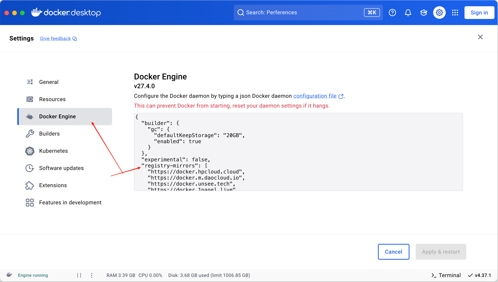

# Docker

## Docker 安装

### In Mac

```
brew install --cask docker
```

## Docker 镜像

### In Mac

去 Docker Engine 添加以下配置registry-mirrors属性，如下

⚠️注意：镜像地址具有时效性，请根据具体时间搜索镜像

```json
{
  "builder": {
    "gc": {
      "defaultKeepStorage": "20GB",
      "enabled": true
    }
  },
  "experimental": false,
  "registry-mirrors": [
    "https://docker.hpcloud.cloud",
    "https://docker.m.daocloud.io",
    "https://docker.unsee.tech",
    "https://docker.1panel.live",
    "http://mirrors.ustc.edu.cn",
    "https://docker.chenby.cn",
    "http://mirror.azure.cn",
    "https://dockerpull.org",
    "https://dockerhub.icu",
    "https://hub.rat.dev",
    "https://proxy.1panel.live",
    "https://docker.1panel.top",
    "https://docker.m.daocloud.io",
    "https://docker.1ms.run",
    "https://docker.ketches.cn"
  ]
}
```



## Docker 命令

