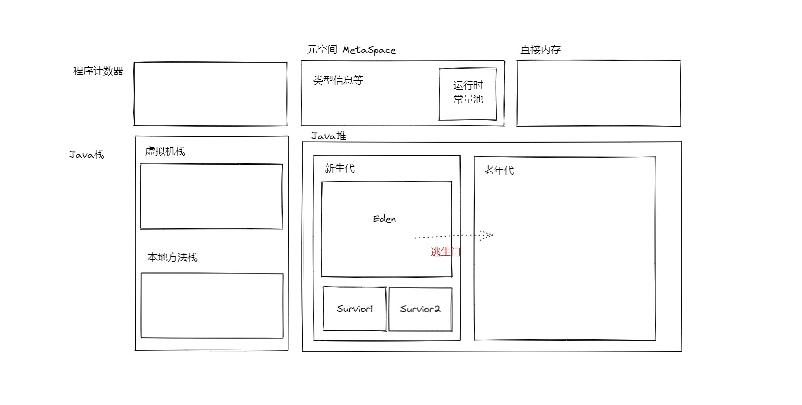
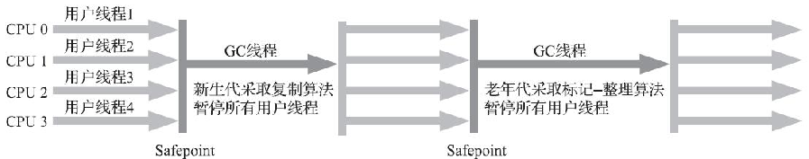
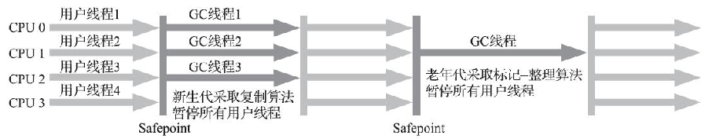
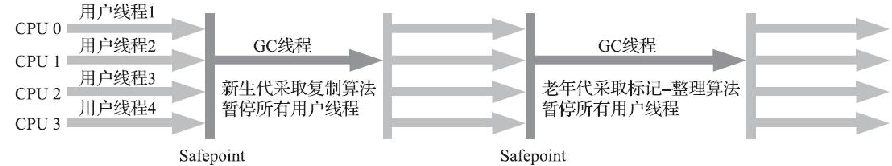
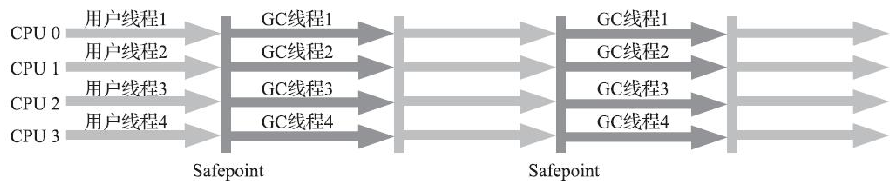
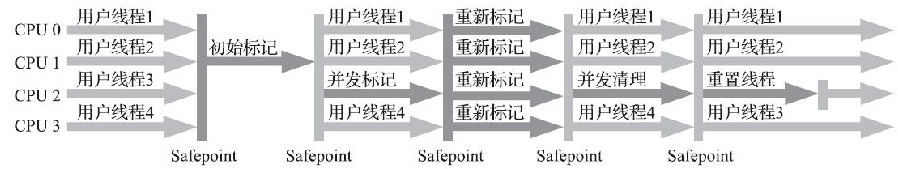

## 二、Java内存区域与内存管理

### 2.1 Java内存划分

涉及到内存分配，就会有OutOfMemory的可能，涉及到栈，就会有StackOverflow的可能

#### 2.1.1 程序计数器

线程私有，字节码解释器工作时就是通过改变这个计数器的值来选取下一条需要执行的字节码指令，控制程序的执行。如果正在执行的是一个Java方法，记录的是正在执行的虚拟机字节码指令的地址；如果正在执行的是native方法，这个计数器值则应为空（Undefined）。

#### 2.1.2 Java 虚拟机栈

线程私有，虚拟机栈描述的是Java方法执行的线程内存模型。每个方法被执行的时候，Java虚拟机都会同步创建一个栈帧（Stack Frame）用于存储局部变量表、操作数栈、动态连接、方法出口等信息

#### 2.1.3 Java本地方法栈

描述的是Native方法执行的线程内存模型

#### 2.1.4 Java堆

> 所有的对象实例以及数组都应当在堆上分配
>
> 关联到一些词：新生代、老年代、Eden、Survivor、Minor GC、Young GC、Full GC等

重点中的重点。线程共享，又称GC堆，垃圾收集在这里大放异彩。主要存放的就是类实例

#### 2.1.5 方法区

> 忘记永久代，从JDK8开始，已经没有永久代了
>
> 元空间MetaSpace：元空间是Java8以后对方法区的一种实现形式，以前用永久代实现，后面用元空间实现

线程共享，用于存储已被虚拟机加载的类型信息、常量、静态变量、即时编译器编译后的代码缓存等数据

#### 2.1.5-2 运行时常量池（归属于方法区）

> 常量不一定只有编译期才能产生，比如String.intern()可以在运行时加入常量池

class文件中有常量池表，用于存放编译期生成的各种字面量与符号引用，这部分内容将在类加载后存放到方法区的运行时常量池中

#### 2.1.6 直接内存

直接内存（Direct Memory）并不是虚拟机运行时数据区的一部分，在JDK 1.4中新加入了NIO（New Input/Output）类，引入了一种基于通道（Channel）与缓冲区（Buffer）的I/O方式，它可以使用Native函数库直接分配堆外内存，然后通过一个存储在Java堆里面的DirectByteBuffer对象作为这块内存的引用进行操作。这样能在一些场景中显著提高性能，因为避免了在Java堆和Native堆中来回复制数据


### 2.2 Hotspot虚拟机与内存

#### 2.2.1 对象的创建

##### 创建过程

`new 指令`、`常量池定位符号引用`、`类加载检查`、`对象分配内存`、`<init>方法`

##### 内存分配方式

- 指针碰撞
  - 假设Java堆中内存是绝对规整的，所有被使用过的内存都被放在一边，空闲的内存被放在另一边，中间放着一个指针作为分界点的指示器，那所分配内存就仅仅是把那个指针向空闲空间方向挪动一段与对象大小相等的距离
  - 指针碰撞要求内存空间是连续的，所以只适合那些存在内存整理的（Compacting）
- 空闲列表
  - 如果Java堆中的内存并不是规整的，已被使用的内存和空闲的内存相互交错在一起，那就没有办法简单地进行指针碰撞了，虚拟机就必须维护一个列表，记录上哪些内存块是可用的，在分配的时候从列表中找到一块足够大的空间划分给对象实例，并更新列表上的记录


而`对象分配内存`，对象创建在虚拟机中是非常频繁的行为，即使仅仅修改一个指针所指向的位置，在并发情况下也并不是线程安全的

- 方案一：对分配内存空间的动作进行同步处理——实际上虚拟机是采用CAS配上失败重试的方式保证更新操作的原子性

- 方案二：每个线程在Java堆中预先分配一小块内存，称为本地线程分配缓冲（Thread Local Allocation Buffer，TLAB），哪个线程要分配内存，就在哪个线程的本地缓冲区中分配，只有本地缓冲区用完了，分配新的缓存区时才需要同步锁定。虚拟机是否使用TLAB，可以通过-XX：+/-UseTLAB参数来设定

#### 2.2.2 对象的内存布局

主要包括：`对象头`、`实例数据`、`对齐填充`

##### 对象头

HotSpot虚拟机对象的对象头部分包括两类信息

- 第一类--Mark Word：用于存储对象自身的运行时数据，如哈希码（HashCode）、GC分代年龄、锁状态标志、线程持有的锁、偏向线程ID、偏向时间戳等，这部分数据的长度在32位和64位的虚拟机（未开启压缩指针）中分别为32个比特和64个比特，

  > TODO: 以下内容可能有误
  >
  > 当对象处于无锁状态时，Mark Word 中有位置存储哈希码。而当对象处于偏向锁状态时，Mark Word 中没有位置存储哈希码，因为偏向锁需要利用这部分空间来存储偏向线程的 ID。如果在同步代码块之前调用了 `hashCode()` 方法，则对象头中会有哈希码，此时锁状态会变为不可偏向，且再执行同步代码块时，锁会直接是轻量级锁。当锁状态从偏向锁或其他轻量级锁升级为重量级锁时，Mark Word 的内容会发生变化，以适应重量级锁的需求。在这个过程中，如果对象之前已经计算过哈希码，这个哈希码不会被“交给锁保存”。实际上，哈希码仍然与对象本身相关联，只是由于 Mark Word 结构的变化，它可能不再直接存储在 Mark Word 中。
  > 在重量级锁状态下，对象的哈希码可能会通过其他机制（如对象头的其他部分、对象的元数据等）来访问，但这取决于 JVM 的具体实现。

- 第二类--类型指针：即对象指向它的类型元数据的指针，Java虚拟机通过这个指针来确定该对象是哪个类的实例。并非所有虚拟机都如此实现，此外，如果对象是一个Java数组，那在对象头中还必须有一块用于记录数组长度的数据

##### 实例数据

实例数据是对象真正存储的有效信息，即我们在程序代码里面所定义的各种类型的字段内容，无论是从父类继承下来的，还是在子类中定义的字段都必须记录起来

##### 对齐填充

对齐填充并不是必然存在的，也没有特别的含义，它仅仅起着占位符的作用。HotSpot虚拟机的自动内存管理系统要求对象起始地址必须是8字节的整数倍，换句话说就是任何对象的大小都必须是8字节的整数倍。对象头部分已经被精心设计成正好是8字节的倍数（1倍或者2倍），因此，如果对象实例数据部分没有对齐的话，就需要通过对齐填充来补全。


#### 2.2.3 对象的访问定位

Java程序会通过栈上的reference数据来操作堆上的具体对象。由于reference类型在《Java虚拟机规范》里面只规定了它是一个指向对象的引用，并没有定义这个引用应该通过什么方式去定位、访问到堆中对象的具体位置，所以对象访问方式也是由虚拟机实现而定的

> ##### 句柄访问
>
> Java堆中将可能会划分出一块内存来作为句柄池，reference中存储的就是对象的句柄地址，而句柄中包含了对象实例数据与类型数据各自具体的地址信息
>
> 最大好处就是reference中存储的是稳定句柄地址，在对象被移动（垃圾收集时移动对象是非常普遍的行为）时只会改变句柄中的实例数据指针，而reference本身不需要被修改
>
> ##### 直接指针
>
> Java堆中对象的内存布局就必须考虑如何放置访问类型数据的相关信息，reference中存储的直接就是对象地址，如果只是访问对象本身的话，就不需要多一次间接访问的开销
>
> 最大的好处就是速度更快，它节省了一次指针定位的时间开销，由于对象访问在Java中非常频繁，因此这类开销积少成多也是一项极为可观的执行成本，HotSpot虚拟机就是使用的直接指针
>
> 例外：如果使用了Shenandoah收集器的话也会有一次额外的转发


### 2.3 OOM

#### 2.3.1 堆溢出 OOM

```java
package com.nanchaos.tech.jvm;

import java.util.ArrayList;
import java.util.List;

/**
 * VM Args：-Xms10m -Xmx10m -XX:+HeapDumpOnOutOfMemoryError
 */
public class HeapOOMDemo {
    static class OOMObject {
    }

    public static void main(String[] args) {
        List<OOMObject> list = new ArrayList<OOMObject>();

        while (true) {
            list.add(new OOMObject());
        }
    }
}
```


```shell
java.lang.OutOfMemoryError: Java heap space
Dumping heap to java_pid12284.hprof ...
Heap dump file created [13926054 bytes in 0.034 secs]
Exception in thread "main" java.lang.OutOfMemoryError: Java heap space
	at java.util.Arrays.copyOf(Arrays.java:3210)
	at java.util.Arrays.copyOf(Arrays.java:3181)
	at java.util.ArrayList.grow(ArrayList.java:267)
	at java.util.ArrayList.ensureExplicitCapacity(ArrayList.java:241)
	at java.util.ArrayList.ensureCapacityInternal(ArrayList.java:233)
	at java.util.ArrayList.add(ArrayList.java:464)
	at com.nanchaos.tech.jvm.HeapOOMDemo.main(HeapOOMDemo.java:17)
```


#### 2.3.2 栈溢出

虚拟机栈

```java
package com.nanchaos.tech.jvm;

/**
 * VM Args：-Xss128k
 */
public class StackOOMDemo {
    private int stackLength = 1;

    public void stackLeak() {
        stackLength++;
        stackLeak();
    }

    public static void main(String[] args) throws Throwable {
        StackOOMDemo oom = new StackOOMDemo();
        try {
            oom.stackLeak();
        } catch (Throwable e) {
            System.out.println("stack length:" + oom.stackLength);
            throw e;
        }
    }

}
```


```shell
Exception in thread "main" java.lang.StackOverflowError
	at com.nanchaos.tech.jvm.StackOOMDemo.stackLeak(StackOOMDemo.java:8)
	at com.nanchaos.tech.jvm.StackOOMDemo.stackLeak(StackOOMDemo.java:8)
	at com.nanchaos.tech.jvm.StackOOMDemo.stackLeak(StackOOMDemo.java:8)
```


#### 2.3.3 直接内存溢出

```java
package com.nanchaos.tech.jvm;

import sun.misc.Unsafe;

import java.lang.reflect.Field;

/**
 * VM Args：-Xmx20M -XX:MaxDirectMemorySize=10M
 */
public class DirectMemoryOOM {

    private static final int _1MB = 1024 * 1024;

    public static void main(String[] args) throws Exception {
        Field unsafeField = Unsafe.class.getDeclaredFields()[0];
        unsafeField.setAccessible(true);
        Unsafe unsafe = (Unsafe) unsafeField.get(null);
        while (true) {
            unsafe.allocateMemory(_1MB);
        }
    }
}
```


``` shell
Exception in thread "main" java.lang.OutOfMemoryError
	at sun.misc.Unsafe.allocateMemory(Native Method)
	at com.nanchaos.tech.jvm.DirectMemoryOOM.main(DirectMemoryOOM.java:20)
```


#### 对比：

如果是堆内存溢出，会提示：`java.lang.OutOfMemoryError: Java heap space`堆内存溢出，但是直接内存溢出不会

## 三、垃圾回收器与内存分配

> 三件事
>
> 1. 哪些内存需要回收
> 2. 什么时候回收
> 3. 如何回收

### 3.1 如何确定不再使用的对象

#### 3.1.1 引用计数法

在对象上添加一个引用计数器，每当有一个地方在引用它，计数器就加一，取消引用就减一，计数器为零的就是不再使用的，但是引用计数法存在缺点：很难解决循环引用的问题

#### 3.1.2 可达性分析

通过GC Roots根对象作为起始节点，从根节点开始，根据引用关系进行搜索，如果可以与GC Roots不相关联，则认为是不会再被使用的

##### 哪些可以作为GC Roots

以下是固定的

- 在虚拟机栈引用的对象（栈帧中的本地变量表）比如：参数、局部变量、临时变量等
- 方法区中静态引用的对象，比如引用类型静态变量
- 方法区中常量引用的对象，比如字符串常量池
- 本地方法栈中JNI引用的对象
- Java虚拟机内部的引用，如：常驻的异常对象、系统类加载器
- 所有被同步锁持有的对象
- 反映Java虚拟机内部情况的JMXBean、JVMTI中注册的回调、本地代码缓存

还有一些是临时加入的


#### 3.1.3 引用的类型

- Strongly Reference
  - 普遍存在的引用赋值==Object a = new Object
  - 只要存在，垃圾回收器就不会回收被引用的对象
- Soft Reference
  - 描述一些还存在，但是非必须的对象
  - 只被软引用关联着的对象，在系统将要发生内存溢出异常前，会把这些对象列进回收范围之中进行第二次回收，如果这次回收还没有足够的内存，才会抛出内存溢出异常
- Weak Reference
  - 也是用来描述那些非必须对象，但是它的强度比软引用更弱一些，被弱引用关联的对象只能生存到下一次垃圾收集发生为止。当垃圾收集器开始工作，无论当前内存是否足够，都会回收掉只被弱引用关联的对象
- Phantom Reference
  - 它是最弱的一种引用关系。一个对象是否有虚引用的存在，完全不会对其生存时间构成影响，也无法通过虚引用来取得一个对象实例。为一个对象设置虚引用关联的唯一目的只是为了能在这个对象被收集器回收时收到一个系统通知。


#### 3.1.4 回收分析

- 01 可达性分析

  - 与GC Roots相关联对象------跳过

  - 与GC Roots无关联对象------进行第一次标记

    - 进行筛选（此对象是否有必要执行finalize()方法）

      > finalize方法只会被执行一次

      - 没有必要执行，则会被直接回收掉-----（未覆盖finalize方法 或 finalize方法已经执行过）

      - 有必要执行

        - 添加进F-Queue队列，并等待Finalizer线程执行finalize方法

          > Finalizer线程由虚拟机自动建立的、低调度优先级；“执行”是指虚拟机会触发这个方法开始运行，但并不承诺一定会等待它运行结束，如果某个对象的finalize()方法执行缓慢，或者更极端地发生了死循环，将很可能导致F-Queue队列中的其他对象永久处于等待，甚至导致整个内存回收子系统的崩溃

          - 对F-Queue中的对象进行第二次小规模的标记

            > 只要重新与引用链上的任何一个对象建立关联即可成功拯救自己，譬如把自己（this关键字）赋值给某个类变量或者对象的成员变量，它将被移出“即将回收”的集合

 


```java
package com.nanchaos.tech.demo;

/**
 * copy from 周志明大佬的《深入理解Java虚拟机 第三版》
 * 此代码演示了两点：
 * 1.对象可以在被GC时自我拯救。
 * 2.这种自救的机会只有一次，因为一个对象的finalize()方法最多只会被系统自动调用一次
 * @author zzm
 */
public class FinalizeEscapeGC {

    public static FinalizeEscapeGC SAVE_HOOK = null;

    public void isAlive() {
        System.out.println("yes, i am still alive :)");
    }

    @Override
    protected void finalize() throws Throwable {
        super.finalize();
        System.out.println("finalize method executed!");
        FinalizeEscapeGC.SAVE_HOOK = this;
    }

    public static void main(String[] args) throws Throwable {
        SAVE_HOOK = new FinalizeEscapeGC();

        //对象第一次成功拯救自己
        SAVE_HOOK = null;
        System.out.println("is going to run GC");
        System.gc();
        // 因为Finalizer方法优先级很低，暂停0.5秒，以等待它
        Thread.sleep(500);
        if (SAVE_HOOK != null) {
            SAVE_HOOK.isAlive();
        } else {
            System.out.println("no, i am dead :(");
        }

        // 下面这段代码与上面的完全相同，但是这次自救却失败了
        SAVE_HOOK = null;
        System.gc();
        // 因为Finalizer方法优先级很低，暂停0.5秒，以等待它
        Thread.sleep(500);
        if (SAVE_HOOK != null) {
            SAVE_HOOK.isAlive();
        } else {
            System.out.println("no, i am dead :(");
        }
    }
}
```


#### 3.1.5 回收方法区

《Java虚拟机规范》不要求虚拟机在方法区中实现垃圾收集，回收的性价比也很低。方法区的垃圾收集主要回收两部分内容：`废弃的常量`和`不再使用的类型`。

##### 常量回收

条件：没有任何字符串对象引用常量池中的当前常量，且虚拟机中也没有其他地方引用这个字面量

##### 类型回收

条件如下

- 该类所有的实例都已经被回收，也就是Java堆中不存在该类及其任何派生子类的实例
- 加载该类的类加载器已经被回收，这个条件除非是经过精心设计的可替换类加载器的场景，如OSGi、JSP的重加载等，否则通常是很难达成的
- 该类对应的java.lang.Class对象没有在任何地方被引用，无法在任何地方通过反射访问该类的方法

但也并非满足了上述三个条件就一定会被回收


### 3.2 垃圾回收算法

> Richard Jones 《垃圾回收算法手册》

#### 3.2.1 分代收集理论

##### 几个分代假说

- 弱分代假说
  - 绝大多数对象都是朝生夕灭的。
- 强分代假说
  - 熬过越多次垃圾收集过程的对象就越难以消亡。
- 跨代引用假说
  - 跨代引用相对于同代引用来说仅占极少数。


前两个分代假说共同奠定了多款常用的垃圾收集器的一致的设计原则：收集器应该将Java堆划分出不同的区域，然后将回收对象依据其年龄（年龄即对象熬过垃圾收集过程的次数）分配到不同的区域之中存储。也就关联到了常常听到的`新生代`、`老年代`（忽略永生代，永生代后来被Metaspace取代了）等词汇，以及`Minor GC`、`Major GC`、`Full GC`等回收类型，并出现了与之匹配的不同垃圾回收算法，包括`标记-复制`、`标记-清除`、`标记-整理`。

跨代引用假说：如果某个新生代对象存在跨代引用，由于老年代对象难以消亡，该引用会使得新生代对象在收集时同样得以存活，进而在年龄增长之后晋升到老年代中，这时跨代引用也随即被消除了

> Partial GC，顾名思义：部分GC，即不是对整个Java堆进行回收，包括以下
>
> - Minor GC / Young GC:：新生代收集
> - Major GC / Old GC：老年代收集，目前只有CMS收集器会有单独收集老年代的行为，而Major GC有语义歧义，有的时候会指整堆收集
> - Mixed GC：标是收集整个新生代以及部分老年代的垃圾收集。目前只有G1收集器会有这种行为
>
> Full GC：收集整个Java堆和方法区的垃圾收集。注意：目前方法区不太可能会被垃圾回收，所以大概率还是堆


#### 3.2.2 垃圾收集算法

##### 标记-清除算法（Mark-Sweep）

分为两个阶段

- 首先标记出所有需要回收的对象
- 在标记完成后，统一回收掉所有被标记的对象

也可以反过来

- 首先标记出所有不需要回收的对象，即存活的
- 在标记完成后，统一回收所有未被标记的对象


主要缺点：

- 执行效率不稳定，如果Java堆中包含大量对象，而且其中大部分是需要被回收的，这时必须进行大量标记和清除的动作，导致标记和清除两个过程的执行效率都随对象数量增长而降低
- 内存空间碎片化，标记、清除之后会产生大量不连续的内存碎片，空间碎片太多可能会导致当以后在程序运行过程中需要分配较大对象时无法找到足够的连续内存而不得不提前触发另一次垃圾收集动作

所以：适合存活量多的，这样标记的也比较少，碎片比较少


##### 标记-复制算法

将可用内存按容量划分为大小相等的两块，每次只使用其中的一块。当这一块的内存用完了，就将还存活着的对象复制到另外一块上面，然后再把已使用过的内存空间一次清理掉。

缺点：将可用内存缩小为了原来的一半，空间浪费未免有点多，在对象存活率较高时就要进行较多的复制操作

所以：适合存活量比较少的，这样复制的就少，即新生代


研究发现：98%熬不过第一轮收集。因此并不需要按照1∶1的比例来划分新生代的内存空间。所以也有了半区复制分代策略（**Appel式回收**）

**Appel式回收**

把新生代分为一块较大的Eden空间和两块较小的Survivor空间，每次分配内存只使用Eden和其中一块Survivor。发生垃圾搜集时，将Eden和Survivor中仍然存活的对象一次性复制到另外一块Survivor空间上，然后直接清理掉Eden和已用过的那块Survivor空间，HotSpot虚拟机默认Eden和Survivor的大小比例是8∶1。

如果不止呢，就是说有超过10%的存货对象，8:1的分配策略就不足了

- 所以，有了`逃生门`安全策略：当Survivor空间不足以容纳一次Minor GC之后存活的对象时，就需要依赖其他内存区域（实际上大多就是老年代）进行分配担保，进入老年代。




##### 标记整理算法（Mark-Compact）

三个阶段

- 首先标记出所有不需要回收的对象，即存活的
- 让所有存活的对象都向内存空间一端移动
- 直接清理掉边界以外的内存

而移动时，因为老年代有大量对象存活，所以很繁重，必须全程暂停用户应用程序才能进行，也就有了`STW`（Stop The World）

问题：必须移动对象吗？不移动和移动到底谁划算？

答：取决于吞吐量。从垃圾收集的停顿时间来看，不移动对象停顿时间会更短，甚至可以不需要停顿，但是从整个程序的吞吐量来看，移动对象会更划算。吞吐量的实质是赋值器与收集器的效率总和，即使不移动对象会使得收集器的效率提升一些，但因内存分配和访问相比垃圾收集频率要高得多，这部分的耗时增加，总吞吐量仍然是下降的

- 关注延迟 --- HotSpot虚拟机 CMS收集器
- 关注吞吐量 --- HotSpot虚拟机 Parallel Scavenge收集器


也有两种都采用的方式：平时使用标记-整理，留下空间碎片，等到内存空间的碎片化程度已经大到影响对象分配时，再采用标记-整理算法收集一次。


### 3.3 Hotsopt虚拟机实现

暂时略


### 3.4 经典垃圾收集器

#### 3.4.1 Serial收集器

在JDK 1.3.1之前是HotSpot虚拟机新生代收集器的唯一选择。迄今为止，它依然是HotSpot虚拟机运行在**客户端**模式下的默认新生代收集器，有着优于其他收集器的地方，那就是简单而高效




#### 3.4.2 ParNew收集器

JDK 1.4.2之后发布

ParNew收集器实质上是Serial收集器的多线程并行版本，除了同时使用多条线程进行垃圾收集之外，其余的行为包括Serial收集器可用的所有控制参数、收集算法、Stop The World、对象分配规则、回收策略等都与Serial收集器完全一致。式下的HotSpot虚拟机是不少运行在服务端模式下的HotSpot虚拟机，尤其是JDK 7之前的遗留系统中首选的新生代收集器，其中有一个与功能、性能无关但其实很重要的原因是：除了Serial收集器外，目前只有它能与CMS收集器配合工作

> CMS：老年代收集器，JDK5发布，关注停顿时间




#### 3.4.3 Parallel Scavenge收集器

JDK 1.4.2之后发布

Parallel Scavenge收集器的目标则是达到一个可控制的吞吐量（Throughput）。所谓吞吐量就是处理器用于运行用户代码的时间与处理器总消耗时间的比值

#### 3.4.4 Serial Old收集器

Serial Old是Serial收集器的老年代版本，它同样是一个单线程收集器，使用标记-整理算法。这个收集器的主要意义也是供客户端模式下的HotSpot虚拟机使用。

如果在服务端模式下，它也可能有两种用途

- JDK 5以及之前的版本中与Parallel Scavenge收集器搭配使用
  - 但其实Parallel Scavenge有老年代的PS MarkSweep实现，但是该收集器与Serial Old的实现是几乎完全一样的
- CMS收集器发生失败时的后备预案，在并发收集发生Concurrent Mode Failure时使用



#### 3.4.5 Parallel Old收集器

JDK6发布

Parallel Old是Parallel Scavenge收集器的老年代版本，支持多线程并发收集，基于标记-整理算法实现。这个收集器是直到JDK 6时才开始提供的




#### 3.4.6 CMS收集器（Concurrent Mark Sweep）

是以获取最短回收停顿时间为目标的收集器，比一遍的标记清除要复杂一点

- 01 初始标记（CMS initial mark） --- STW
  - 只是标记一下GC Roots能直接关联到的对象，速度很快
- 02 并发标记（CMS concurrent mark）
  - 从GC Roots的直接关联对象开始遍历整个对象图的过程，这个过程耗时较长但是不需要停顿用户线程，可以与垃圾收集线程一起并发运行
- 03 重新标记（CMS remark） --- STW
  - 则是为了修正并发标记期间，因用户程序继续运作而导致标记产生变动的那一部分对象的标记记录
- 04 并发清除（CMS concurrent sweep）
  - 清理删除掉标记阶段判断的已经死亡的对象，由于不需要移动存活对象，所以这个阶段也是可以与用户线程同时并发的

并发标记和并发清除阶段在整个过程中耗时最长，但可以与用户线程一起工作。




#### 3.4.7 G1收集器

Garbage First（简称G1）收集器是垃圾收集器技术发展历史上的里程碑式的成果，它开创了收集器面向局部收集的设计思路和基于Region的内存布局形式
