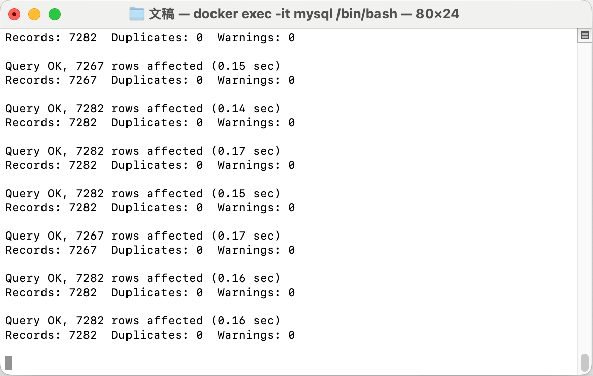

以下所有模块几乎都分为`知识`、`部署`、`使用`，知识一般会链接到其他文档，部署一般都是使用 Docker，会给到命令，使用一般都是通过 SpringBoot 写一个测试例，所以可以提前准备好一个 SpringBoot 应用

## SpringBoot AOP

### 知识


### 使用

#### maven

```xml
<dependency>
    <groupId>org.springframework.boot</groupId>
    <artifactId>spring-boot-starter-aop</artifactId>
</dependency>

<dependency>
    <groupId>org.aspectj</groupId>
    <artifactId>aspectjtools</artifactId>
</dependency>
```

#### Java Code

aop 需要确定自己的使用场景，以下举例是针对 api 下的接口增加统一日志打印如耗时统计

##### 注解

```java
package com.nanchaos.tech.config.aop.ann;

import java.lang.annotation.ElementType;
import java.lang.annotation.Retention;
import java.lang.annotation.RetentionPolicy;
import java.lang.annotation.Target;

/**
 * Default Description
 *
 * @author nanchaos
 * @date 2025/1/8
 * @time 09:53
 */
@Retention(RetentionPolicy.RUNTIME)
@Target(ElementType.METHOD)
public @interface AppInterfaceLog {

    /**
     * 是否将入参和返回 打印为 json 建议仅调试时使用
     */
    boolean printJSON() default false;

    /**
     * 接口告警阈值
     * 该大于该值时，more than limit:{}打印为 true
     */
    long alarmThreshold() default 300L;

    /**
     * 当接口异常时，，若为 true，返回默认结构的 error response, 为 false 返回为 null
     */
    boolean useDefaultErrorResp() default true;
}

```


##### 切面

以下定义了两个切点，

`@Pointcut("execution(* com.nanchaos.tech.service..*(..))")`

- 是把切点放在 tech.service 下的所有方法

`@annotation(com.nanchaos.tech.config.aop.ann.AppInterfaceLog)`

- 把切点放在注解上

`@Around("pointcutService()|| pointcutAppInterfaceLog()")`

- 表示只要命中其中一个，就会走到切面代码里，从左往右匹配

```Java
package com.nanchaos.tech.config.aop;

import com.alibaba.fastjson.JSON;
import com.nanchaos.tech.config.aop.ann.AppInterfaceLog;
import lombok.extern.slf4j.Slf4j;
import org.apache.commons.lang3.exception.ExceptionUtils;
import org.aspectj.lang.ProceedingJoinPoint;
import org.aspectj.lang.Signature;
import org.aspectj.lang.annotation.Around;
import org.aspectj.lang.annotation.Aspect;
import org.aspectj.lang.annotation.Pointcut;
import org.aspectj.lang.reflect.MethodSignature;
import org.springframework.stereotype.Component;
import org.springframework.util.StopWatch;

import java.util.Objects;

/**
 * Default Description
 *
 * @author nanchaos
 * @date 2025/1/8
 * @time 09:53
 */
@Slf4j
@Aspect
@Component
public class AppInterfaceLogAdvice {

    @Pointcut("execution(* com.nanchaos.tech.service..*(..))")
    public void pointcutService() {
    }

    @Pointcut("@annotation(com.nanchaos.tech.config.aop.ann.AppInterfaceLog)")
    public void pointcutAppInterfaceLog() {
    }

    @Around("pointcutService()|| pointcutAppInterfaceLog()")
    public Object around(ProceedingJoinPoint joinPoint) {
        log.info("AppInterfaceLogAdvice.around.start");

        // traceLogId替换为网关trace，若非网关请求使用uuid生成trace，实现略。。。
        // 耗时监控
        StopWatch stopWatch = new StopWatch();
        stopWatch.start();

        Object result = null;
        boolean isPrintAsJson = false, useDefaultErrorResp = false;
        long alarmThreshold = 300L;
        String methodName = "UNKNOWN", className = null;
        Signature signature = joinPoint.getSignature();
        MethodSignature methodSignature = (MethodSignature) signature;

        if (methodSignature != null) {
            AppInterfaceLog annotation = methodSignature.getMethod().getAnnotation(AppInterfaceLog.class);
            if (annotation != null) {
                alarmThreshold = annotation.alarmThreshold();
                isPrintAsJson = annotation.printJSON();
                useDefaultErrorResp = annotation.useDefaultErrorResp();
            }
            className = joinPoint.getTarget().getClass().getName();
            methodName = methodSignature.getName();
        }

        log.info("AppName AppInterfaceLogAdvice.around.process, current is {}.{}, threadHold is:{}, args is:{}", className, methodName, alarmThreshold, isPrintAsJson ? JSON.toJSONString(joinPoint.getArgs()) : joinPoint.getArgs());

        try {
            result = joinPoint.proceed();
            log.info("AppName AppInterfaceLogAdvice.around.finish, current is {}.{}", className, methodName);
        } catch (Throwable throwable) {
            // 使用标准错误返回，实现略
            if (useDefaultErrorResp) result = null;
            log.error("AppName AppInterfaceLogAdvice.around.error, cause:{}", ExceptionUtils.getStackTrace(throwable));
        }
        stopWatch.stop();
        log.info("AppName AppInterfaceLogAdvice.around.end, current is {}.{}, time used:[{}ms], is more than limit:{}, result is:{}", className, methodName, stopWatch.getTotalTimeMillis(), stopWatch.getTotalTimeMillis() > alarmThreshold, result);
        return result;
    }
}

```


## SpringBoot With MySQL

### 部署

#### By Docker

> 如果是云服务器，记得防火墙设置

```shell
# 创建MySQL容器 注意替换yourpassword
 docker run -di --name mysql -p 3306:3306 -e MYSQL_ROOT_PASSWORD=yourpassword mysql
 
# 上面已创建完成，但是mysql 8以后不能使用 root 账户远程登录，所以单独创建一个用户专门用来远程登录
# 进入容器
docker exec -it mysql /bin/bash
 
# 登入mysql
mysql -u root -p
 
# 创建远程访问用户
CREATE USER 'remoteAccount'@'%' IDENTIFIED BY 'remotePassword';
 
# 授权
grant all privileges on *.* to 'remoteAccount'@'%' with grant option; 

# 刷新权限
flush privileges;

# 其他可能用到的
# 1. docker 导入数据文件
## 复制文件到 docker mysql内，这里的 mysql 是容器的名称，可以使用 id 替换
docker cp /你的目录/xxx.sql mysql:/
## 登录 并刷数据
msyql -u root -p
source /xxx.sql
```



## SpringBoot With Redis

### 知识

此处不做具体展开，详细参照 [Redis 知识](../middleware/Redis.md)

### 部署

#### By Docker

```shell
#:7.4.2是，指定版本，此时 redis 有 8 的 alpine 版本，所以指定为7.4.2
docker run --name chaos-redis -p 6379:6379 -d redis:7.4.2
```

### 使用

#### maven

```xml
<dependency>
  <groupId>org.springframework.boot</groupId>
  <artifactId>spring-boot-starter-data-redis</artifactId>
</dependency>
```

#### application.yml

```yaml
spring:
  redis:
    host: redis.nanchaos.com
    port: 6379
```

#### Java Code

```java
package com.nanchaos.tech.redis;

import com.nanchaos.tech.TechValidationApplication;
import lombok.extern.slf4j.Slf4j;
import org.junit.jupiter.api.Test;
import org.springframework.boot.test.context.SpringBootTest;
import org.springframework.data.redis.core.StringRedisTemplate;

import javax.annotation.Resource;

/**
 * Default Description
 *
 * @author nanchaos
 * @date 2025/1/8
 * @time 17:21
 */
@Slf4j
@SpringBootTest(classes = TechValidationApplication.class)
public class RedisTest {
    @Resource
    private StringRedisTemplate stringRedisTemplate;

    @Test
    public void testAdd(){
        // 对应 redis-cli: SET REDIS_KEY 'this is redis value'
        stringRedisTemplate.opsForValue().set("REDIS_KEY", "this is redis value");
    }

    @Test
    public void testGet(){
        // 对应 redis-cli: GET REDIS_KEY
        stringRedisTemplate.opsForValue().get("REDIS_KEY");
    }
}

```

