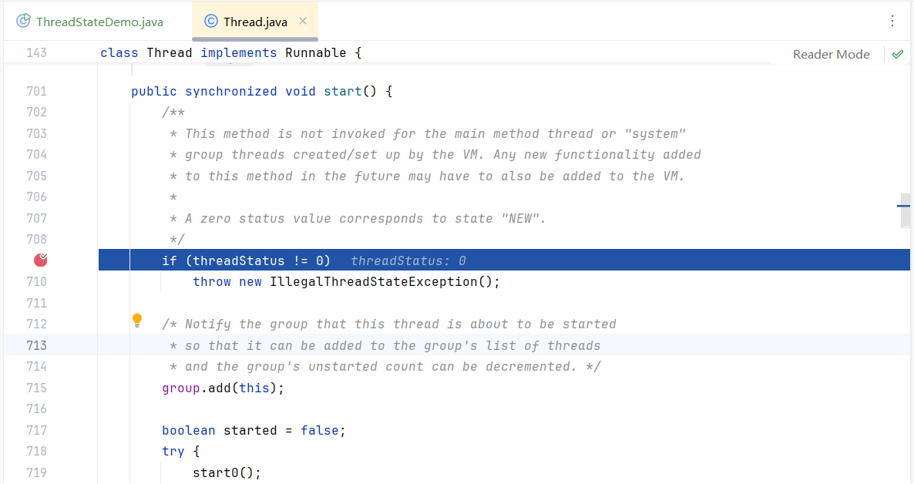
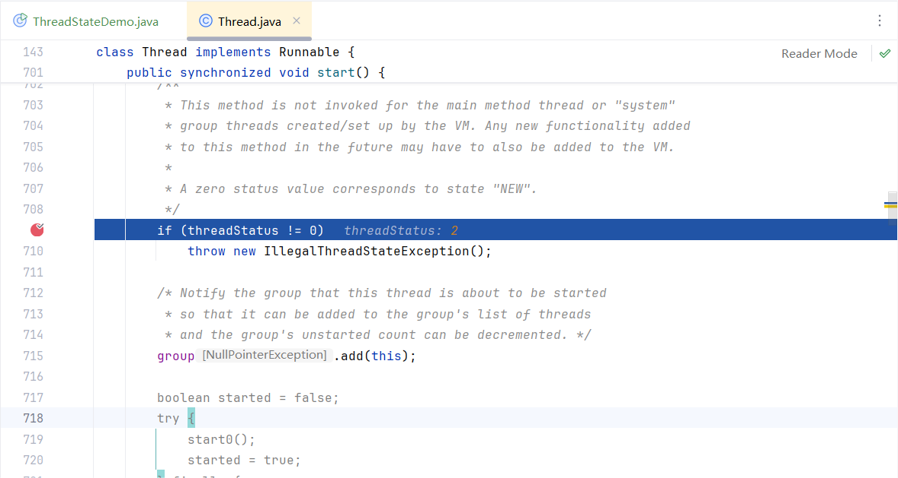

# Java 多线程与并发

代码相关分支：`chaos/learn/concurrent`，此分支移除了一些redis、ES等依赖

## 一、多线程基础

### 1.1 多线程实现

Thread类和Runnable接口

#### 1.1.1 继承Thread类

继承Thread类，重写run方法，外部调用start()启动

> 注意
>
> - 调用run方法也可以执行任务，但是调用run是同步的，调用start才是异步的
> - 不可多次调用start方法，不然会报错 IllegalThreadStateException

示例代码：

```java
package com.nanchaos.tech.thread;

import lombok.extern.slf4j.Slf4j;

/**
 * Default Description
 *
 * @author nanchaos
 * @date 2025/2/9
 * @time 16:41
 */
public class ThreadDemo {
    public static void main(String[] args) {
        MyExtendThread myExtendThread = new MyExtendThread();

        // 的启动异步线程
        myExtendThread.start();

        // myExtendThread.start();

        // 同步执行
        // myExtendThread.run();
    }
}

@Slf4j
class MyExtendThread extends Thread {
    @Override
    public void run() {
        log.info("MyExtendThread is running");
    }
}
```

可以看到，一个是main线程，一个是Thread-1线程

```shell
SLF4J: Actual binding is of type [ch.qos.logback.classic.util.ContextSelectorStaticBinder]
16:44:45.361 [main] INFO com.nanchaos.tech.thread.MyExtendThread - MyExtendThread is running
16:44:45.363 [Thread-1] INFO com.nanchaos.tech.thread.MyExtendThread - MyExtendThread is running
```


#### 1.1.2实现Runnable接口

先了解以下Runnable接口，如下所示，Runnable不像Thread，它只有一个run方法，不像Thread可以调用start方法启动线程，所以需要个外部去帮助它：`线程池驱动` 或 `Thread驱动`

```java
// copy from openJDK
@FunctionalInterface
public interface Runnable {
    public abstract void run();
}
```


先来个线程池

```java
package com.nanchaos.tech.thread;

import lombok.extern.slf4j.Slf4j;

import java.util.concurrent.*;

/**
 * Default Description
 *
 * @author nanchaos
 * @date 2025/2/9
 * @time 16:53
 */
@Slf4j
public class AsyncTaskExecutor {
    private AsyncTaskExecutor() {
    }

    /**
     * 核心线程数
     */
    private final static int CORE_POOL_SIZE = 20;

    /**
     * 最大线程数
     */
    private final static int MAX_POOL_SIZE = 30;

    /**
     * 空闲线程存活时间
     */
    private final static int KEEP_ALIVE_TIME = 10;

    /**
     * 等待队列最大容量
     */
    private final static int QUEUE_MAX = 100;

    private static ExecutorService threadPool = null;

    static {
        log.info("AsyncTaskExecutor: start init AsyncTaskExecutorPool");
        threadPool = new ThreadPoolExecutor(
                CORE_POOL_SIZE,
                MAX_POOL_SIZE,
                KEEP_ALIVE_TIME,
                TimeUnit.HOURS,
                new LinkedBlockingQueue<>(QUEUE_MAX),
                Executors.defaultThreadFactory(),
                new ThreadPoolExecutor.CallerRunsPolicy()
        );
    }

    public static void executeTask(Runnable task) {
        threadPool.execute(task);
    }

    public static <T> Future<T> executeTask(Callable<T> task) {
        return threadPool.submit(task);
    }
}
```


再编写任务，示例代码：

```java
package com.nanchaos.tech.thread;

import lombok.extern.slf4j.Slf4j;

/**
 * Default Description
 *
 * @author nanchaos
 * @date 2025/2/9
 * @time 16:41
 */
public class ThreadDemo {
    public static void main(String[] args) {
        // 执行方式1 线程池驱动
        AsyncTaskExecutor.executeTask(new MyRunnableThread());

        // 执行方式2 Thread驱动
        new Thread(new MyRunnableThread()).start();
    }
}

@Slf4j
class MyRunnableThread implements Runnable {
    @Override
    public void run() {
        log.info("MyRunnableThread is running");
    }
}

@Slf4j
class MyExtendThread extends Thread {
    @Override
    public void run() {
        log.info("MyExtendThread is running");
    }
}

```

#### 1.1.3 实现Callable

Runnable与Thread的实现方式，有一个弊端就是：没有返回值，如果我们需要返回值的话，就可以使用Callable，先了解下Callable。Callable也类似Runnable，需要外部驱动，此处借用上方创造的线程池，这里的返回用到了Future，这个等会介绍。

```Java
// copy from openJDK
@FunctionalInterface
public interface Callable<V> {
    V call() throws Exception;
}
```


示例代码：

```java
package com.nanchaos.tech.thread;

import lombok.extern.slf4j.Slf4j;

import java.util.concurrent.Callable;
import java.util.concurrent.ExecutionException;
import java.util.concurrent.Future;

/**
 * Default Description
 *
 * @author nanchaos
 * @date 2025/2/9
 * @time 17:06
 */
@Slf4j
public class MyCallableDemo {
    public static void main(String[] args) throws ExecutionException, InterruptedException {
        Future<String> taskFuture = AsyncTaskExecutor.executeTask(new MyCallableThread());
        // 注意调用get方法会阻塞当前线程，直到得到结果。实际需要设置超时时间
        log.info("MyCallableDemo.AsyncTaskExecutor.executeTask result is:{}", taskFuture.get());
    }
}

@Slf4j
class MyCallableThread implements Callable<String> {

    @Override
    public String call() throws Exception {
        log.info("MyCallableThread is running");
        return "This is a callable thread result";
    }
}
```

#### 1.1.4 简单总结

若想简单实现多线程任务，可以使用`继承Thread类`、`实现Runnable接口`以及`实现Callable接口`，若是注重返回结果，使用Callable；若是不注重返回结果，则使用Thread或者Runnable，那首选哪个呢？个人偏向Runnable，为什么？因为类只能单继承，却可以多实现，当然还是得根据自己的使用场景来

### 1.2 Future 、RunnableFuture 和 FutureTask

#### 1.2.1 Future

```java
public abstract interface Future<V> {
    public abstract boolean cancel(boolean paramBoolean);
    public abstract boolean isCancelled();
    public abstract boolean isDone();
    public abstract V get() throws InterruptedException, ExecutionException;
    public abstract V get(long paramLong, TimeUnit paramTimeUnit)
            throws InterruptedException, ExecutionException, TimeoutException;
}
```

- cancel()

  `cancel`方法是试图取消一个线程的执行。**并不一定能取消成功**。因为任务可能已完成、已取消、或者一些其它因素不能取消，存在取消失败的可能。`boolean`类型的返回值是“是否取消成功”的意思。参数`paramBoolean`表示是否采用中断的方式取消线程执行。

#### 1.2.2 FutureTask

##### 基本

`FutureTask `实现自 `RunnableFuture`

```java
public class FutureTask<V> implements RunnableFuture<V> {}
```


`RunnableFuture` 又继承自`Runnable`、`Future`

```java
public interface RunnableFuture<V> extends Runnable, Future<V> {
    void run();
}
```

`FutureTask`可以看作是JDK提供的一个官方Future实现，供开发人员使用。不然`Future`的`cancel`，`get`，`isDone`等方法要自己实现，是非常复杂的。


示例代码：

```java
package com.nanchaos.tech.thread;

import lombok.extern.slf4j.Slf4j;

import java.util.concurrent.ExecutionException;
import java.util.concurrent.ExecutorService;
import java.util.concurrent.Executors;
import java.util.concurrent.FutureTask;

/**
 * Default Description
 *
 * @author nanchaos
 * @date 2025/2/9
 * @time 17:26
 */
@Slf4j
public class FutureTaskDemo {
    public static void main(String[] args) throws ExecutionException, InterruptedException {
        ExecutorService executor = Executors.newCachedThreadPool();
        FutureTask<String> futureTask = new FutureTask<>(new MyCallableThread());
        executor.submit(futureTask);
        log.info("FutureTask executed result:{}",futureTask.get());
    }
}
```


##### FutureTask的几种状态

运行状态只会在set、setException、cancel方法中终止。COMPLETING、INTERRUPTING是任务完成后的瞬时状态

```java
/* Possible state transitions:
* NEW -> COMPLETING -> NORMAL
* NEW -> COMPLETING -> EXCEPTIONAL
* NEW -> CANCELLED
* NEW -> INTERRUPTING -> INTERRUPTED
*/
private volatile int state;
private static final int NEW          = 0;
private static final int COMPLETING   = 1;
private static final int NORMAL       = 2;
private static final int EXCEPTIONAL  = 3;
private static final int CANCELLED    = 4;
private static final int INTERRUPTING = 5;
private static final int INTERRUPTED  = 6;
```


## 二、线程组和线程优先级

### 2.1 线程组

每个Thread必然存在于一个ThreadGroup中，Thread不能独立于ThreadGroup存在。执行main()方法线程的名字是main，如果在new Thread时没有显式指定，那么默认将父线程（当前执行new Thread的线程）线程组设置为自己的线程组。

```java
package com.nanchaos.tech.thread;

import lombok.extern.slf4j.Slf4j;

import java.util.concurrent.ExecutorService;
import java.util.concurrent.Executors;

/**
 * Default Description
 *
 * @author nanchaos
 * @date 2025/2/9
 * @time 17:38
 */
@Slf4j
public class ThreadGroupDemo {
    public static void main(String[] args) {
        log.info("当前线程名:{}, 当前线程组:{}", Thread.currentThread().getName(), Thread.currentThread().getThreadGroup().getName());

        Thread thread = new Thread(() -> {
            log.info("当前线程名:{}, 当前线程组:{}", Thread.currentThread().getName(), Thread.currentThread().getThreadGroup().getName());
        });
        thread.start();
    }
}
```

ThreadGroup是一个标准的**向下引用**的树状结构，这样设计的原因是**防止"上级"线程被"下级"线程引用而无法有效地被GC回收**

### 2.2线程优先级

Java中线程优先级可以指定，范围是1~10。但是并不是所有的操作系统都支持10级优先级的划分（比如有些操作系统只支持3级划分：低，中，高），Java只是给操作系统一个优先级的**参考值**，线程最终**在操作系统的优先级**是多少还是由操作系统决定。

Java默认的线程优先级为5，线程的执行顺序由调度程序来决定，线程的优先级会在线程被调用之前设定。

通常情况下，高优先级的线程将会比低优先级的线程有**更高的几率**得到执行。我们使用方法`Thread`类的`setPriority()`实例方法来设定线程的优先级。

但是要注意，设置优先级不是一定有效的，高优先级的不一定优先执行

```java
package com.nanchaos.tech.thread;

import lombok.extern.slf4j.Slf4j;

/**
 * Default Description
 *
 * @author nanchaos
 * @date 2025/2/9
 * @time 17:48
 */
@Slf4j
public class ThreadPriorityDemo {
    public static void main(String[] args) {

        Thread thread1 = new Thread();
        Thread thread2 = new Thread();
        thread2.setPriority(Thread.MAX_PRIORITY);
        
        log.info("thread1.priority: {}, thread2.priority: {}", thread1.getPriority(), thread2.getPriority());
    }
}

// thread1.priority: 5, thread2.priority: 10
```


注意：线程的优先级不能超过所在线程组的优先级，超过将是线程组的最高优先级，如下所示

```java
package com.nanchaos.tech.thread;

/**
 * Default Description
 *
 * @author nanchaos
 * @date 2025/2/9
 * @time 18:03
 */
public class ThreadPriorityInGroupDemo {
    public static void main(String[] args) {
        ThreadGroup threadGroup = new ThreadGroup("t1");
        threadGroup.setMaxPriority(6);
        Thread thread = new Thread(threadGroup,"thread");
        thread.setPriority(9);
        System.out.println("线程组的优先级"+threadGroup.getMaxPriority());
        System.out.println("线程的优先级"+thread.getPriority());
    }
}

// 线程组的优先级6
// 线程的优先级6
```


## 三、线程细节

### 3.1 操作系统线程状态

操作系统线程主要有以下三个状态：

- 就绪状态(ready)：线程正在等待使用CPU，经调度程序调用之后可进入running状态。
- 执行状态(running)：线程正在使用CPU。
- 等待状态(waiting): 线程经过等待事件的调用或者正在等待其他资源（如I/O）。  

### 3.2 Java线程状态

```java
// copy from openJDK java.lang.Thread.State
public enum State {
        NEW,

        RUNNABLE,

        BLOCKED,

        WAITING,

        TIMED_WAITING,

        TERMINATED;
    }
```

#### 3.2.1 New

 处于NEW状态的线程此时尚未启动。这里的尚未启动指的是还没调用Thread实例的start()方法。如：

```java
package com.nanchaos.tech.thread;

import lombok.extern.slf4j.Slf4j;

/**
 * Default Description
 *
 * @author nanchaos
 * @date 2025/2/9
 * @time 18:11
 */
@Slf4j
public class ThreadStateDemo {
    public static void main(String[] args) {
        Thread thread = new Thread();
        System.out.println(thread.getState());
    }
}
```


关于为什么不能调用多次start的代码上的限制

Thread.start()

```java
// copy from openJDK
public synchronized void start() {

        if (threadStatus != 0) throw new IllegalThreadStateException();
        group.add(this);

        boolean started = false;
        try {
            start0();
            started = true;
        } finally {
            try {
                if (!started) {
                    group.threadStartFailed(this);
                }
            } catch (Throwable ignore) {
                /* do nothing. If start0 threw a Throwable then
                  it will be passed up the call stack */
            }
        }
    }
```


看不出来，所以debug看一下

```java
@Slf4j
public class ThreadStateDemo {
    public static void main(String[] args) {
        Thread thread = new Thread();
        System.out.println(thread.getState());

        thread.start();
        System.out.println(thread.getState());
        thread.start();
    }
}
```


第一次start，threadStatus 是0



第二次start，threadStatus 是2 ，于是抛出异常




#### 3.2.2 RUNNABLE

表示当前线程正在运行中。处于RUNNABLE状态的线程在Java虚拟机中运行，也有可能在等待其他系统资源（比如I/O）。

> Java线程的**RUNNABLE**状态其实是包括了传统操作系统线程的**ready**和**running**两个状态的。

#### 3.2.3 BLOCKED

阻塞状态。处于BLOCKED状态的线程正等待锁的释放以进入同步区。

#### 3.2.4 WAITING

等待状态。处于等待状态的线程变成RUNNABLE状态需要其他线程唤醒。

调用如下3个方法会使线程进入等待状态：

- Object.wait()：使当前线程处于等待状态直到另一个线程唤醒它；
- Thread.join()：等待线程执行完毕，底层调用的是Object实例的wait方法；
- LockSupport.park()：除非获得调用许可，否则禁用当前线程进行线程调度。  


#### 3.2.5 TIMED_WAITING

超时等待状态。线程等待一个具体的时间，时间到后会被自动唤醒。

调用如下方法会使线程进入超时等待状态：

- Thread.sleep(long millis)：使当前线程睡眠指定时间；
- Object.wait(long timeout)：线程休眠指定时间，等待期间可以通过notify()/notifyAll()唤醒；
- Thread.join(long millis)：等待当前线程最多执行millis毫秒，如果millis为0，则会一直执行；
- LockSupport.parkNanos(long nanos)： 除非获得调用许可，否则禁用当前线程进行线程调度指定时间；
- LockSupport.parkUntil(long deadline)：同上，也是禁止线程进行调度指定时间；


#### 3.2.6 TERMINATED

终止状态。此时线程已执行完毕。


### 3.3 Thread的几个方法

- yield()：yield在英语里有放弃的意思，同样，这里的yield()指的是当前线程愿意让出对当前处理器的占用。这里需要注意的是，就算当前线程调用了yield()方法，程序在调度的时候，也还有可能继续运行这个线程的；
- sleep()：静态方法，使当前线程睡眠一段时间；
- join()：使当前线程等待另一个线程执行完毕之后再继续执行，内部调用的是Object类的wait方法实现的